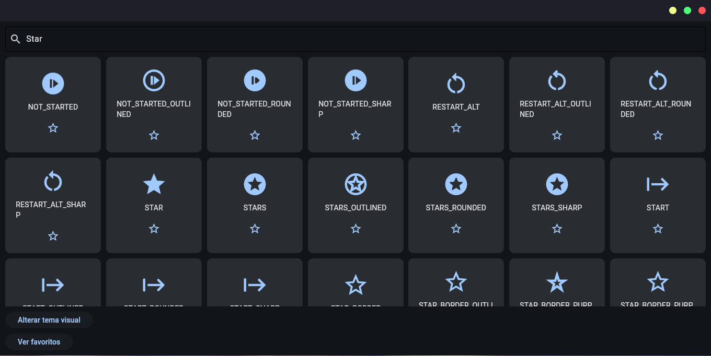

# Flet Icons Navigator

A simple and intuitive icon navigator built with Flet and Python. This application allows users to search for icons, preview them, and manage a list of favorites.

## 🚀 Technologies Used

- **Python**: The core programming language.
- **Flet**: A framework that enables building interactive multi-platform apps in Python based on Flutter.

## 📁 Project Structure

```text
.
├── icon_container.py
├── main.py
├── README.md
└── requirements.txt
```

## ⚙️ How to Execute

To run this project locally, follow these steps:

1. **Clone the repository:**

   ```bash
   git clone <repository-url>
   cd project-python-flet-icons-navigator
   ```

2. **Create a virtual environment:**

   ```bash
   python3 -m venv .venv
   ```

3. **Activate the virtual environment:**
   - **Linux/macOS:**

     ```bash
     source .venv/bin/activate
     ```

   - **Windows:**

     ```bash
     .venv\Scripts\activate
     ```

4. **Install dependencies:**

   ```bash
   pip install -r requirements.txt
   ```

5. **Run the application:**

   ```bash
   flet run main.py
   ```

   _Alternatively, you can run `python main.py` if Flet is correctly configured in your path._

## 📸 Previews

### Main Screen


### Search Functionality


### Icon Details



### Favorites List


